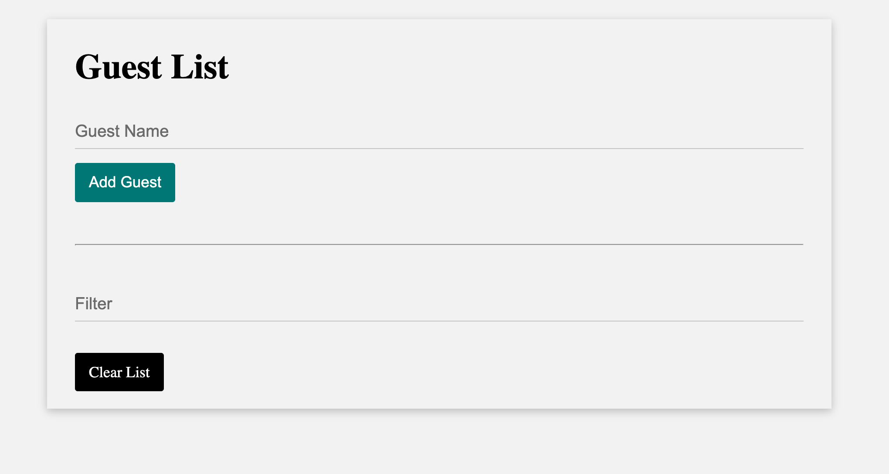

# Guest List

This is a project created to practive Vanilla JavaScript. UI Design was inspired by a task list project that used Materialize UI.

## Table of contents

- [Overview](#overview)
  - [About](#about)
  - [Screenshot](#screenshot)
  - [Links](#links)
- [My process](#my-process)
  - [Built with](#built-with)
  - [Useful resources](#useful-resources)
- [Author](#author)

## Overview

### About

Users should be able to:

- Add a guest to the list
- Guest will than be saved to Local Storage
- Individual guest can be deleted
  - Alert will ask the user to confirm wanting to delete a guest from the list
- Clear button now clears all guests from the UI and from Local Storage

### Screenshot

### Links

- Solution URL: [View Github Code](https://github.com/jchapar/JavaScript/tree/master/guestList)

## My process

### Built with

- Semantic HTML5 markup
- CSS custom
- Vanilla JavaScript
- Flexbox
- Local Storage

### Useful resources

- [Local Storage Docs](https://developer.mozilla.org/en-US/docs/Web/API/Window/localStorage)

## Author

- Frontend Mentor - [@jchapar](https://www.frontendmentor.io/profile/jchapar)
- Twitter - [@j_chapar](https://www.twitter.com/j_chapar)
